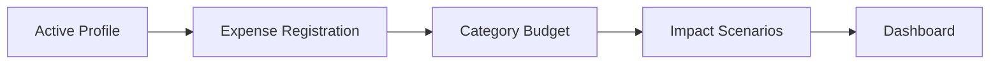

# baseZero

Portuguese: [README.md](README.md)

A financial management app built with Next.js, focused on operational simplicity and practical monthly planning workflows.

It supports persisted profiles, expense management, category budgeting, impact scenarios, and a settings area in Portuguese (pt-PT).

## Table of Contents

- [Overview](#overview)
- [Tech Stack](#tech-stack)
- [Features](#features)
- [Quick Start](#quick-start)
- [Development Scripts](#development-scripts)
- [Architecture and Structure](#architecture-and-structure)
- [Quality and Testing](#quality-and-testing)
- [CI](#ci)

## Overview

baseZero organizes the monthly financial cycle into four areas:

1. Dashboard: status summary and key indicators
2. Transactions/Expenses: expense registration and editing
3. Planning: budget and scenario simulation
4. Settings: profile context and active plan

## Tech Stack

| Area | Technology |
| --- | --- |
| Framework | Next.js (App Router) |
| Language | JavaScript |
| UI | React + global CSS |
| Quality | ESLint |
| E2E Tests | Playwright |
| UI Language | pt-PT |

## Features

- Context profiles: Personal, Student, Family, Home
- Expenses with create, edit, and summary export
- Category budget with derived metrics
- Simple scenarios to simulate monthly impact
- Profile and plan settings with local reset
- E2E coverage for critical flows

## Quick Start

Prerequisites:

- Node.js 18+ (recommended)
- npm 9+

Install and run:

```bash
npm install
npm run dev
```

Open in browser:

```text
http://localhost:3000/visao/painel
```

## Development Scripts

| Script | Description |
| --- | --- |
| npm run dev | Starts the development server |
| npm run build | Creates the production build |
| npm run start | Runs the app in production mode |
| npm run lint | Runs ESLint checks |
| npm run test:e2e:install | Installs Chromium for Playwright |
| npm run test:e2e | Runs the E2E test suite |
| npm run test:e2e:headed | Runs E2E with a visible browser |

## Architecture and Structure

```text
app/(app)                 # Main shell and application pages
config/routes.mjs         # Canonical routes and legacy redirects
lib/finance-store.js      # Persisted state and derived calculations
messages/pt-PT            # UI labels, copy, and messages
tests/e2e                 # Functional regression with Playwright
```

Functional flow (high-level):



## Quality and Testing

Recommended local validation before opening a PR:

```bash
npm run lint
npm run build
npm run test:e2e
```

## CI

The repository includes a GitHub Actions pipeline in .github/workflows/ci.yml with the following steps:

1. npm run lint
2. npm run build
3. npm run test:e2e
