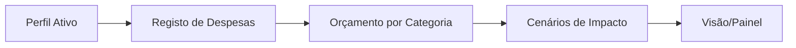

# baseZero

Aplicação de gestão financeira construída com Next.js, focada em simplicidade operacional e fluxos reais de planeamento mensal.

Suporta perfis persistidos, gestão de despesas, orçamento por categoria, cenários de impacto e área de definições em português (pt-PT).

## Índice

- [Visão Geral](#visão-geral)
- [Stack Técnica](#stack-técnica)
- [Funcionalidades](#funcionalidades)
- [Quick Start](#quick-start)
- [Scripts de Desenvolvimento](#scripts-de-desenvolvimento)
- [Arquitetura e Estrutura](#arquitetura-e-estrutura)
- [Qualidade e Testes](#qualidade-e-testes)
- [CI](#ci)

## Visão Geral

O baseZero organiza o ciclo financeiro mensal em quatro áreas:

1. Visão: síntese de estado e indicadores
2. Movimentos/Despesas: registo e edição de despesas
3. Planeamento: orçamento e simulação de cenários
4. Definições: contexto de perfil e plano ativo

## Stack Técnica

| Área | Tecnologia |
| --- | --- |
| Framework | Next.js (App Router) |
| Linguagem | JavaScript |
| UI | React + CSS global |
| Qualidade | ESLint |
| Testes E2E | Playwright |
| Idioma da UI | pt-PT |

## Funcionalidades

- Perfis de contexto: Pessoal, Estudante, Família, Casa
- Despesas com criação, edição e exportação de resumo
- Orçamento por categoria com métricas derivadas
- Cenários simples para simular impacto mensal
- Definições de perfil e plano com reposição local
- Cobertura E2E para fluxos críticos

## Quick Start

Pré-requisitos:

- Node.js 18+ (recomendado)
- npm 9+

Instalação e arranque:

```bash
npm install
npm run dev
```

Abrir no browser:

```text
http://localhost:3000/visao/painel
```

## Scripts de Desenvolvimento

| Script | Descrição |
| --- | --- |
| npm run dev | Inicia o servidor de desenvolvimento |
| npm run build | Gera o build de produção |
| npm run start | Arranca a aplicação em modo produção |
| npm run lint | Executa validações com ESLint |
| npm run test:e2e:install | Instala Chromium para Playwright |
| npm run test:e2e | Executa a suite E2E |
| npm run test:e2e:headed | Executa E2E com browser visível |

## Arquitetura e Estrutura

```text
app/(app)                 # Shell principal e páginas da aplicação
config/routes.mjs         # Rotas canónicas e redirects legados
lib/finance-store.js      # Estado persistido e cálculos derivados
messages/pt-PT            # Labels, copy e mensagens da interface
tests/e2e                 # Regressão funcional com Playwright
```

Fluxo funcional (alto nível):



## Qualidade e Testes

Executar validação local recomendada antes de abrir PR:

```bash
npm run lint
npm run build
npm run test:e2e
```

## CI

O repositório inclui pipeline em .github/workflows/ci.yml com os seguintes passos:

1. npm run lint
2. npm run build
3. npm run test:e2e
